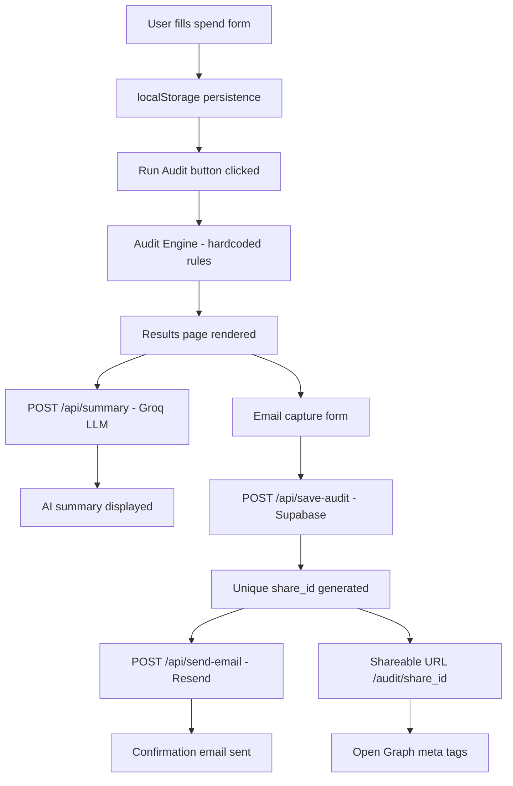

# Architecture

## System Diagram



## Data Flow
1. User input → validated client-side → stored in localStorage
2. Audit engine runs entirely client-side — no latency, no API calls
3. Results rendered instantly
4. On email submit → Supabase row created → Resend email triggered
5. Share URL fetches from Supabase by share_id, strips PII

## Why Next.js
- App Router gives file-based API routes without a separate backend
- Vercel deployment is zero-config
- TypeScript support first-class
- Server components reduce client bundle size

## What I'd change at 10k audits/day
- Move audit engine to Edge Runtime for global low latency
- Add Redis cache for share URL lookups
- Supabase connection pooling via PgBouncer
- Rate limiting per IP on all API routes via Upstash

## System Overview

```mermaid
graph TD
    A[User Browser] --> B[Next.js App]
    B --> C[Spend Input Form]
    C --> D[Audit Engine]
    D --> E[Anthropic API]
    C --> F[Supabase DB]
    D --> G[Shareable URL]
